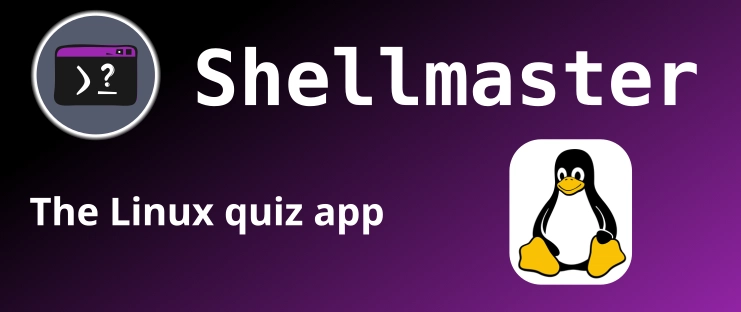

Das Erlernen von Linux-Shell-Befehlen kann entmutigend sein, aber was wäre, wenn es auch Spaß machen könnte? Das ist die Idee hinter **Shellmaster**, einer Quizspiel-App, die Benutzern hilft, Shell- und Bash-Befehle durch spannende Quizspiele zu meistern.
Probieren Sie es im Google Play Store aus: [Shellmaster - Apps on Google Play](https://play.google.com/store/apps/details?id=com.matschcode.shellmaster)
Während der Entwicklung von Shellmaster stieß ich auf einige interessante technische Herausforderungen und lernte viel über **Flutter**, **PocketBase**, **Unleash feature flags** und **Google Play Console deployment**. In diesem Artikel werde ich einige der wichtigsten Erkenntnisse aus der Entwicklungszeit mit Ihnen teilen.
## Inhaltsverzeichnis

1. [App Features](#app-features)
2. [App Development](#app-development)
	1. [Choosing Flutter for a Cross-Platform Quiz App](#choosing-flutter-for-a-cross-platform-quiz-app)
	2. [PocketBase as a Lightweight Backend](#pocketbase-as-a-lightweight-backend)
	3. [Using Unleash for Feature Flags](#using-unleash-for-feature-flags)
	4. [Deploying via Google Play Console](#deploying-via-google-play-console)
3. [Conclusion](#conclusion)


---

## App-Funktionen

Shellmaster wurde entwickelt, um das Lernen von Linux-Befehlen unterhaltsam und interaktiv zu gestalten. Hier sind einige der wichtigsten Funktionen:

- **Multiple Quiz Modes**: Testen Sie Ihr Wissen mit verschiedenen Spielmodi, einschließlich zeitlich begrenzter Quizze und Übungssitzungen.
- **Difficulty Levels & Categories**: Die Fragen sind in leichte, mittlere und schwere Schwierigkeitsgrade eingeteilt und decken grundlegende Shell-Befehle, Skripting und Systemadministration ab.
- **Progress Tracking**: Behalten Sie Ihre Leistung im Auge und verbessern Sie sich mit der Zeit.
- **Custom Challenges**: Benutzer können ihre eigenen Herausforderungen einstellen und sich mit Freunden messen.
- **Offline Support**: Spielen Sie Quizze, ohne eine Internetverbindung zu benötigen.
- **Dark Mode**: Genießen Sie einen eleganten dunklen Modus für bessere Lesbarkeit.

---

## APP-Entwicklung

In den nächsten Kapiteln geht es um mein Lernen während des Entwicklungsprozesses.
Wenn Sie Interesse an Flutter haben, lesen Sie weiter. Wenn Sie nur wegen Linux und Bash hier sind, schauen Sie sich die App im Google Play Store [Shellmaster - Apps on Google Play](https://play.google.com/store/apps/details?id=com.matschcode.shellmaster) an.
### Die Wahl von Flutter für eine plattformübergreifende Quiz-App

Ich habe **Flutter** wegen seiner **fast development cycle, beautiful UI capabilities, and cross-platform support** gewählt. Mit einer einzigen Codebasis konnte ich in Zukunft sowohl Android als auch (potenziell) iOS ansprechen. Einige der wichtigsten Funktionen von Flutter, die ich genutzt habe, sind:

- **Custom UI components**: Ich habe eine benutzerdefinierte AppBar (`CSAppBar`) für ein einheitliches Aussehen erstellt.
- **State management**: Ich habe `provider` verwendet, um den Quizstatus und die Benutzereinstellungen effizient zu verwalten.
- **Smooth animations**: Animierte Änderungen der Hintergrundfarbe in den Quizfragen verbessern das Benutzererlebnis.

---

### PocketBase als leichtgewichtiges Backend

Für die Verwaltung von Quizdaten, Benutzerfortschritt und Authentifizierung habe ich mich für **PocketBase** entschieden, ein in Go geschriebenes Open-Source-Backend. Es bietet ein **SQLite database, real-time subscriptions, and an API with minimal setup**. Hier ist, warum es für Shellmaster gut funktioniert hat:

- **Self-hosted control**: Wenn ich PocketBase auf meinem VPS laufen lasse, habe ich vollen Datenbesitz.
- **Easy integration**: PocketBase stellt eine REST-API zur Verfügung, die von Flutters `http`-Paket einfach genutzt werden kann.
- **User authentication**: Die eingebaute Authentifizierung erlaubt es mir, den Fortschritt der Benutzer geräteübergreifend zu verwalten. Ich werde in Zukunft die Möglichkeit zur Benutzeranmeldung hinzufügen.

### Beispiel: Abrufen von Quizdaten aus PocketBase

```dart
Future<List<Question>> fetchQuestions() async {
  final response = await http.get(Uri.parse('https://your-pocketbase-url/api/collections/questions/records'));
  final data = jsonDecode(response.body);
  return data['items'].map<Question>((json) => Question.fromJson(json)).toList();
}
```

---

### Verwendung von Unleash für Feature Flags

Um **progressive feature rollouts and A/B testing** zu ermöglichen, habe ich **Unleash**, ein Open-Source-System für Funktionskennzeichen, integriert. Dies ermöglichte mir, **toggle features dynamically** ohne ein neues App-Update zu veröffentlichen.

#### Warum Feature-Flags verwenden?

- **Experiment with new features** (z. B. ein "Hardcore-Modus" für erfahrene Benutzer)
- **Enable/disable features remotely**, ohne dass ein App-Update erforderlich ist
- **Gradual rollouts** für Tests mit einer Untergruppe von Benutzern

#### Implementierung von Feature-Flags in Flutter

```dart
final unleash = UnleashClient(appName: 'shellmaster', instanceId: 'your-instance-id', url: 'https://your-unleash-server');
await unleash.start();
bool isHardcoreModeEnabled = unleash.isEnabled('hardcore-mode');
```

---

### Bereitstellung über Google Play Console

Die Veröffentlichung von Shellmaster auf der **Google Play Store** umfasst mehrere wichtige Schritte:

1. **App Signing & Bundling**: Flutters `flutter build appbundle` machte die Erstellung eines **AAB**-Pakets einfach.
2. **Play Console Setup**: Das Einrichten von **store listings, screenshots, and descriptions** nahm mehr Zeit in Anspruch als erwartet.
3. **Testing & Release Tracks**: Die Verwendung von **internal, closed, and open testing** half, Fehler vor der vollständigen Bereitstellung zu finden.
4. **Review Process**: Der Überprüfungsprozess von Google erforderte die ordnungsgemäße Einhaltung von Datenrichtlinien, insbesondere für die Nutzerauthentifizierung.


---

## Fazit

Die Entwicklung von Shellmaster war eine aufregende Reise, bei der **Flutter’s UI capabilities, PocketBase’s lightweight backend, Unleash’s feature flags, and Google Play Console deployment** kombiniert wurde. Das Ergebnis ist eine unterhaltsame und lehrreiche Quiz-App, die Benutzern hilft, ihre Linux-Shell-Kenntnisse interaktiv zu verbessern.

Wenn Sie interessiert sind, schauen Sie sich **Shellmaster** auf der [Shellmaster - Apps on Google Play](https://play.google.com/store/apps/details?id=com.matschcode.shellmaster) an und lassen Sie mich Ihre Meinung wissen!

Welche interessanten Tech-Stacks haben Sie in Ihren Anwendungen verwendet? Diskutieren Sie mit mir in den Kommentaren!