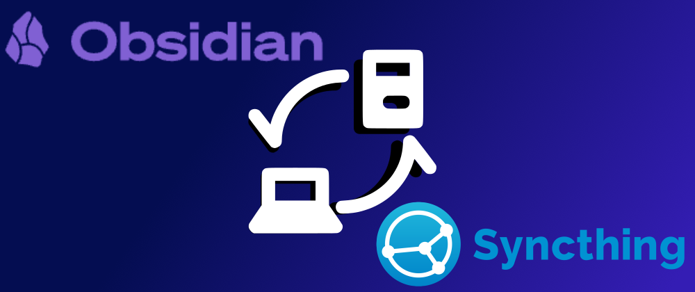

  

Es gibt zwei Arten von Notizenmachern: diejenigen, die ihre wertvollen Gedanken der Cloud anvertrauen (hallo Notion/Google Drive/OneNote-Leute), und diejenigen, die in den Abgrund starren und denken: *"Was wäre, wenn ich meine eigene Infrastruktur dafür aufbauen würde? "*.

Ich gehöre zur zweiten Gruppe.  
Hier ist, wie ich **Syncthing + Obsidian + a webserver** in ein notizsynchronisierendes, backupfreudiges, Cloud-ersetzendes Monster verwandelt habe.  

---

## Der Kerngedanke

- **Server:** ein VPS, der als mein "Syncthing-Master" fungiert
- **Clients:** Linux-, Windows- und Android-Geräte, die alle fröhlich mit dem Server synchronisieren.  
- **Vault:** Obsidian-Notizen befinden sich in einem einzigen Ordner. Dieser Ordner ist die Quelle der Wahrheit.  

Der Zauber liegt in Syncthing: Jedes Gerät kommuniziert mit dem Server und synchronisiert die Notizen **bi-directionally**. Das bedeutet, dass ich die Notizen überall bearbeiten kann (auf meinem Telefon während der Fahrt, an meinem Desktop während der Programmierarbeit oder auf meinem Laptop, während ich so tue, als würde ich mich auf der Couch entspannen). Innerhalb von Sekunden werden die Änderungen auf alle Geräte übertragen.  

Der Server ist sowohl **sync hub** als auch **backup repository**. Selbst wenn also ein Laptop abstürzt oder mein Handy den Geist aufgibt, sind die Notizen sicher.  

---

## Warum Syncthing?  

Weil es im Grunde die **anti-cloud cloud** ist.

- Keine Konten, keine Abonnements, keine Bindung an einen Anbieter.  
- Läuft auf allem (Linux, Windows, macOS, Android, sogar auf Routern, wenn Sie darauf stehen).  
- Peer-to-Peer-Magie: Geräte kommunizieren direkt, wenn sie es können, oder über ein Relais, wenn sie es nicht können.  
- Einmal eingerichtet, funktioniert es "einfach so".  
- Einfach einzurichten mit **Coolify**

Es ist wie Dropbox, nur nerdiger und ohne die unheimlichen Nutzungsbedingungen.  

---

## Obsidian Layer

Obsidian behandelt seine **vault setup** (Themen, Plugins, Arbeitsbereichskonfiguration) wie weitere Dateien. Das bedeutet: sobald Sie Ihren Tresor-Ordner in Syncthing werfen, **the entire setup syncs too**.

Das ist richtig: Ich kann ein Plugin auf meinem Linux-Rechner installieren, und Sekunden später ist es wie von Zauberhand auch unter Windows und Android verfügbar. Meine Hotkeys, mein Farbschema, meine verrückten Plugin-Kombinationen - sie alle folgen mir überall hin.  

---

## Zusätzliche Funktionen

Jetzt wird es lustig. Ich habe mich nicht damit begnügt, "nur Notizen zu synchronisieren".  

### GitHub Backup

Ich lasse einen Cron-Job laufen, der den gesamten Tresor in ein privates GitHub-Repositorium verschiebt.  

Warum? Weil:  
1. **Extra safety net** (nie genug Backups).  
2. **Version control**: das ist im Grunde die Git-Geschichte meines Gehirns.  

### Automatisierte Dateiverarbeitung

Manchmal werden Notizen unordentlich. Anhänge stapeln sich, Screenshots landen an zufälligen Orten.  

Die Lösung: ein kleines Python-Skript (das auch über cron läuft), das aufräumt und alles neu organisiert.  
Betrachten Sie es als eine Art Roomba für meinen Tresor.  

---

## Jenseits von Notizen: Syncthing als persönliche Cloud

Hier ist der Clou: Sobald Sie Syncthing auf einem VPS zum Laufen gebracht haben, haben Sie im Grunde Ihre eigene **cloud framework** aufgebaut. Notizen sind nur der Anfang.  

- **Google Drive replacement**: Fügen Sie einen beliebigen Ordner hinzu, den Sie geräteübergreifend synchronisieren möchten. Erledigt.  
- **Phone DCIM backup**: Mein Android-Gerät überträgt neue Fotos direkt auf den Server, auch wenn ich im Ausland bin. Sie sind sofort sicher, ohne dass ich jemals "Google Fotos" anfassen muss.
  Achten Sie auf den Speicherplatz auf Ihrem Server. Bilder brauchen viel mehr Platz als Notizen.

Ich stelle mir das gerne so vor: **Syncthing is my cloud OS, the VPS is the data center, and my devices are just clients.**

---

## TL;DR Setup

- VPS mit installiertem Syncthing → fungiert als Master- und Backup-Hub.  
- Clients: Linux, Windows, Android mit Syncthing.  
- Vault-Ordner = überall synchronisiert.  
- Obsidian-Konfiguration = ebenfalls synchronisiert.  
- Extra Gewürz: GitHub-Backup, Python-Skripte, Cron-Jobs.  
- Bonus: Syncthing dient als Ersatz für Google Drive und Fotosicherung.  

---

## Abschließende Überlegungen

Die meisten Leute zahlen für Cloud-Speicher. Ich ziehe es vor, für einen VPS zu bezahlen und meinen eigenen zu hacken.  
Mit Syncthing + Obsidian bekomme ich **real-time sync, complete control, no vendor lock-in** und etwas mehr Nerd-Glaubwürdigkeit.  

Wenn Sie sich für Self-Hosting und Datenbesitz interessieren oder einfach nur gerne an der Infrastruktur basteln, kann ich Ihnen diese Kombination nicht genug empfehlen. Es sind nicht nur Notizen - es ist ein selbstgehostetes Cloud-Ökosystem.