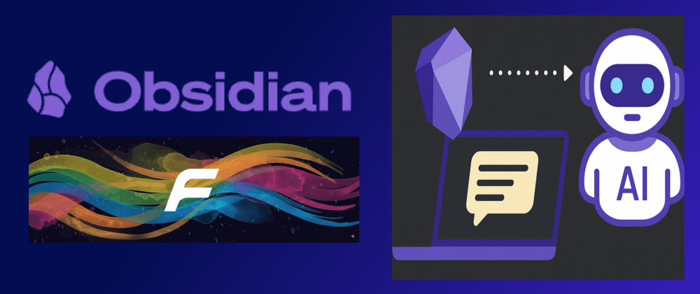

  

## Introduction
If you’ve been following my Obsidian setup, you know I love keeping my notes synchronized across devices with Syncthing ([My Obsidian + Syncthing Setup: A Self-Hosted Cloud for Notes, Backups, and More](https://matsch1.github.io/web/en/coding/07_obsidian_syncthing_cloud_setup/)). But I wanted more than just syncing—I wanted to **interact with my notes intelligently, anywhere, anytime**.

## Why Obsidian HTTP MCP?
That’s why I developed **Obsidian HTTP MCP**, a lightweight server built on [FastMCP](https://gofastmcp.com/getting-started/welcome) that exposes your Obsidian vault over HTTP using the MCP protocol.

With this server, you can:
- **Connect AI clients** like Cursor directly to your vault, enabling natural-language search, analytics, and even automated note modifications.
- **Query your notes on demand** from scripts, dashboards, or any device that can speak HTTP.
- **Keep it lightweight and fast** thanks to the FastMCP foundation.

Essentially, your vault is no longer just storage—it becomes an interactive knowledge engine.

## How It Works
Each note in your vault is treated as an MCP “packet.” The server exposes endpoints to read, update, or analyze these packets. Using HTTP transport keeps things simple, secure, and accessible behind standard firewalls.

The real fun comes with **AI integration**. You can ask your desktop AI assistant to summarize notes, find relevant information, or even generate content based on your vault—all by chatting naturally. It’s like giving your notes a brain of their own.

## What Makes It Nerdy-Perks-Worthy
- **AI-powered workflows:** Chat with your vault, analyze content, or modify notes programmatically.
- **Cross-device access:** Talk to your vault from scripts, mobile apps, or web tools.
- **Minimal overhead:** Stateless and efficient, perfect for lightweight setups.
- **Hackable:** Build bots, dashboards, or automation around your notes.
- **Secure:** Runs behind your existing security without requiring cloud services.

### Examples of Cool AI Interactions
- **Natural-language search & summaries:** Ask your AI to find or summarize notes in plain English.
- **Automated note updates & generation:** Let AI create or modify notes, draft meeting minutes, or generate flashcards.
- **Vault analytics & insights:** Track trends, gaps, and recurring topics across your notes.
- **Personal knowledge assistant:** Chat with your vault to answer questions, suggest connections, or recommend topics.
- **Code & workflow automation:** Use AI to generate scripts, organize notes, or trigger automated workflows.

## Setup
- Run the MCP server on your remote server in a Docker container with one single command.
- Add the client config to your desktop AI client (e.g., Cursor):
```json
{
 "mcpServers": {
   "obsidian-http-mcp": {
     "transport": "http",
     "url": "http://localhost:9001/mcp",
     "headers": {
       "Authorization": "Bearer <MCP_API_KEY>"
     }
   }
 }
}
```
- Start interacting with your notes.

For a more detailed description, check out the GitHub repository: [obsidian-http-mcp](https://github.com/matsch1/obsidian-http-mcp) and start chatting with your notes today!
	
## TL;DR
Obsidian HTTP MCP is a lightweight server that exposes your Obsidian vault over HTTP using the MCP protocol. It lets you connect AI clients like Cursor to your notes for natural-language search, summaries, analytics, and automated modifications. Run it on a remote server, connect your AI client, and instantly turn your vault into an interactive, AI-powered knowledge engine. Check it out on GitHub [obsidian-http-mcp](https://github.com/matsch1/obsidian-http-mcp)!

