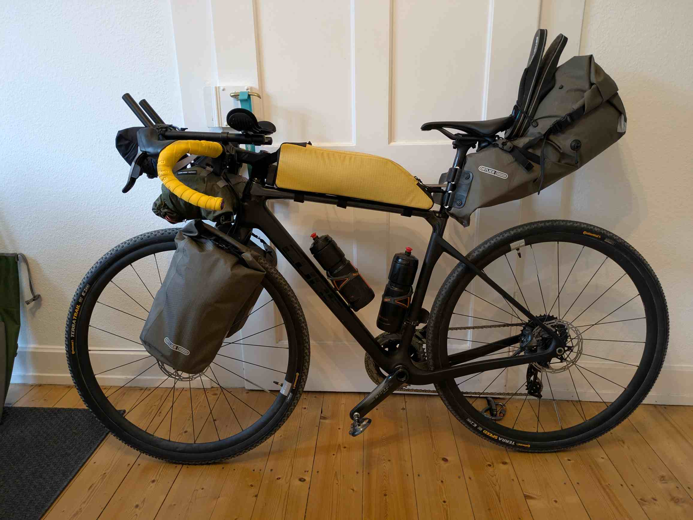

## Der Plan
Ich werden einen Monat mit dem Fahrrad durch Dänemark, Schweden und Norwegen fahren.
Dabei möchte ich wildcampen und die vielen schönen Shelterplätze der
skandinavischen Länder nutzen. 
Mein Gepäck soll dabei möglichst leicht sein, jedoch ein alles nötige für einen
Monat Reise bieten.

## Route
Die grobe Routenplanung geht, mit Start und Ende in Flensburg, durch folgende Städte: 
Kopenhagen, Göteborg, Oslo, Larvik, Hirtshals, Esbjerg
Dabei möchte ich täglich ca. 100 km radeln.

***Update***
Ich habe die Route unterwegs geändert und bin nicht mehr hoch bis nach Oslo gefahren, sondern in Göteborg wieder nach Dänemark übergesetzt.


## Gepäck
Das Ziel ist es möglichst leicht zu reisen und dabei eine gute Zeit auf dem Rad
zu haben.
Die folgenden Kapitel beinhalten eine Auflistung der Gegenstände welche ich
mitnehme.
Ich habe leider nicht alles im Detail gewogen, kann aber sagen, dass das ganze
Gepäck inkl. Taschen und 1,8 l Wasser ca. 14 kg wiegt. 

### Gewicht
- Arschrakete: 3,5 kg
- Oberrohrtasche: 0,8 kg
- Lenkertasche mit Schloss: 3,2 kg
- Gabeltasche rechts: 2,5 kg
- Gabeltasche links: 2,5 kg
- Wasser: 2 kg
### Camping 2500g
-  Zelt
-  Groundsheet
-  Luftmatratze 
-  Schlafsack 
-  Liner 
-  Kissen

### Elektronik 1000g
-  Navi
-  Handy
-  Kopflampe 
-  Rücklicht
-  Kopfhörer Shockz 
-  Kopfhörer InEar 
-  Tastatur 
-  Brustgurt 
-  Powerbank 
-  Netzteil 
-  Ladekabel Micro-USB
-  Ladekabel USB-C 
-  Ladekabel Uhr 
-  Ladekabel Shockz Kopfhörer 
-  Ladegerät Schaltung 

### Hygiene
-  Medipack 
-  Reiseapotheke 
-  Sonnencreme 
- Creme Gesicht 
-  Bepanthen 
-  Labello 
-  Nobyte 
-  Arschcreme 
-  Zahnbürste 
-  Zahnpasta 
-  Zahnseide + Zwischenraumbürste 
-  Zahnschiene 
-  Nagelclips 
-  Rasierer 
-  Handtuch 
-  Duschgel 4in1 (Duschgel+Spülmittel+Waschmittel)
-  Wäscheklammer 
-  Desinfektionstücher 
-  Klopapier 
-  Tempo 
-  Ohropax 

### Essen
-  Gaskartusche 
-  Kocher 
-  Feuerzeug 
-  Topf 
-  Falttasse 
-  Taschenmesser 
-  Löffel 
-  Wasserflaschen 
-  Instant-Kaffee
-  Tee 
-  Datteln 

### Klamotten
-  Radklamotten 
	- Hose 
	- Unterhemd 
	- Trikot kurz 
	- Socken
-  Ersatz Radklamotten 
	- Hose 
	- Unterhemd 
	- Trikot kurz 
-  Buff 2x 
-  Boulderhose 
-  kurze Hose 
-  Pullover 
-  TShirt 2x 
-  Unterhose 2x 
-  Socken 2x 
-  Badehose 
-  Regenjacke 
-  Überschuhe 
-  Helm 
-  Windbreaker 
-  Flip-Flops 
-  Fahrradhandschuhe 

### Fahrrad
-  Schloss 
-  Reifenheber 
-  Dichtmilch 
-  Tubeless-Salami 
-  Multitool 
-  Kettenwachs 
-  Lappen 
-  Pumpe 
-  Ersatzteile 
	- Schlauch
	- Kabelbinder
	- Kettenschloss
	- Panzerband
	- Schaltauge

### Sonstiges
-  Minirucksack 
-  Buch 
-  Schwimmbrille 
-  Terraband 
-  Sonnenbrille mit Etui 
-  Lesebrille 
-  Geldbeutel 
-  Ausweis 

## Fahrrad
Mein Rad ist ein Cube Nuroad C:62SL. Das ist mit Carbon Rahmen und Gabel, sowie elektronische Schaltung nur bedingt für so eine Tour geeignet. Aber ich hoffe einfach, dass das Carbon nichts gegen so viel Gepäck einzuwenden hat.

Zur Bequemlichkeit lasse ich den Triathlon Lenkeraufsatz dran und rüste auf breite Tubeless Stollenreifen um.
