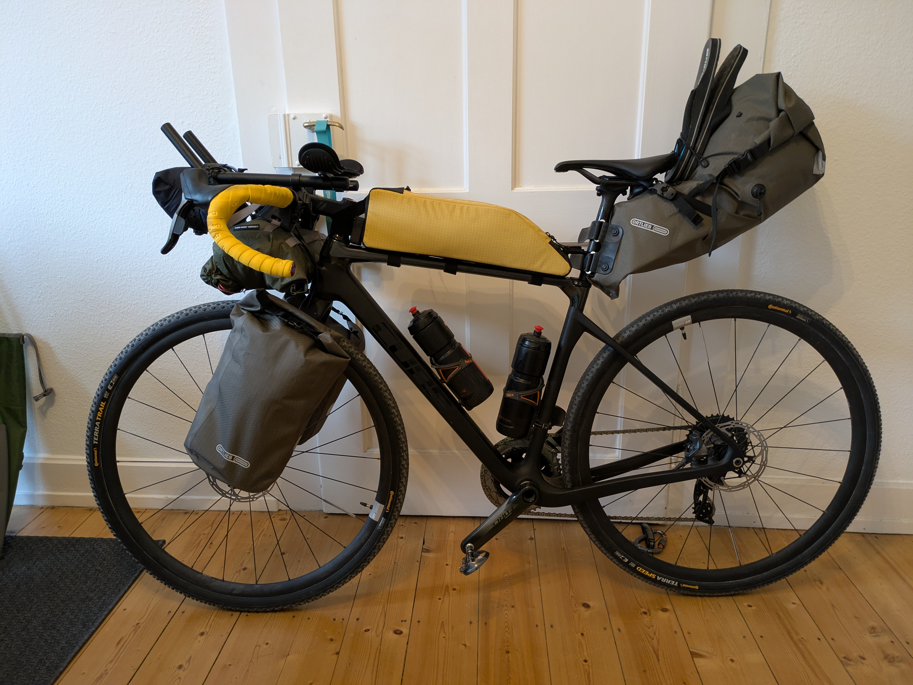

## The plan
I will ride my bike through Denmark, Sweden and Norway for a month.
I would like wild camps and the many beautiful shelter spaces of the
Use Scandinavian countries.
My luggage should be as light as possible, but an everything necessary for one
Offer month.

## route
The rough route planning goes through the following cities with start and end in Flensburg:
Copenhagen, Gothenburg, Oslo, Larvik, Hirtshals, Esbjerg
I would like to cycle about 100 km every day.


### Section 1: Flensburg to Helsingborg (Sweden)
The first section by Denmark looks like this in detail planning:


### Section 2: Helsingborg to Gothenburg (Sweden)
The journey in Sweden begins with the west coastal cycle path (Kattegattlede) to Gothenburg.


### Section 3: Gothenburg to Oslo (Norway)
This section is still unclear.Probably cycle along the coast because this section
should be particularly beautiful.

### Section 4: Oslo to Hirtshals (Denmark)
This section is still unclear.That also depends on how much time
I still stay.The short way would be to be overlooked via Larvik to Denmark.The
Somewhat longer path is still lying on the Norwegian coast and then from
Christiansand in Hirtshals in Denmark.

### Section 5: West Coast Cycle Path (Denmark)
If the wind allows it, I will become the last section to Flensburg, on the
West coastal cycle path Denmark, roll.


## Baggage
The goal is to travel as easy as possible and have a good time on the bike
to have.
The following chapters contain a list of the objects which I
take with me.
Unfortunately I didn't weigh everything in detail, but I can say that the whole thing
Luggage including pockets and 1.8 l water weighs approx. 14 kg.

### Weight
- Afer cheek: 3.5 kg
- Ober tube bag: 0.8 kg
- Lower pocket with lock: 3.2 kg
- fork pocket on the right: 2.5 kg
- fork pocket on the left: 2.5 kg
- Water: 2 kg
### Camping 2500g
-  Tent
- Groundsheet
- air mattress
- sleeping bag
- liner
-  Pillow

### Elektronik 1000G
- Navi
- cell phone
- head lamp
- rear light
- Headphones Shockz
- Headphones Inear
-  Keyboard
- chest strap
- power bank
- power supply
- charging cable micro-USB
- charging cable USB-C
- charging cable watch
- charging cable Shockz headphones
- Charter circuit

### hygiene
- Medipack
- travel pharmacy
- sunscreen
- cream face
- Bepanthen
- Labello
- Nobyte
- ass cream
- toothbrush
- toothpaste
- Dental floss + space brush
- tooth rail
- nail clips
- razor
-  Hand towel
- shower gel 4in1 (shower gel+detergent+detergent)
- clothes peg
- Disinfection towels
- toilet paper
- Tempo
- Ohropax

### Eat
- gas cartridge
- - stove
- lighter
-  Pot
- folding cup
- pocket knife
-  Spoon
- water bottles
- Instant coffee
- tea
- dates

### Clothes
- bike clothes
- pants
- undershirt
- jersey short
- socks
- Replacement bike clothes
- pants
- undershirt
- jersey short
- Buff 2x
- bouldering pants
-  short pants
- sweater
- Tshirt 2x
- Underpants 2x
- socks 2x
- swimming trunks
- rain jacket
- overshoes
- helmet
- windbreaker
- flip-flops
- Bicycle gloves

### Bicycle
-  Lock
- tire lifter
- sealing milk
- Tubeless salami
- multitool
- chain wax
- rag
- pump
- spare parts
- Hose
- cable tie
- chain lock
- tank band
- switching barrel

### Miscellaneous
- mini backpack
-  Book
- swimming goggles
- Terraband
- sunglasses with case
- reading glasses
- wallet
-  ID

## Bicycle
My bike is a Cube Nuroad C: 62SL.This is only suitable for such a tour with carbon frame and fork, as well as electronic circuit.But I just hope that the carbon has no objection to so much luggage.

For convenience, I leave the triathlon handlebar on the handlebars and arms on wide tubeless tunnel tires.
