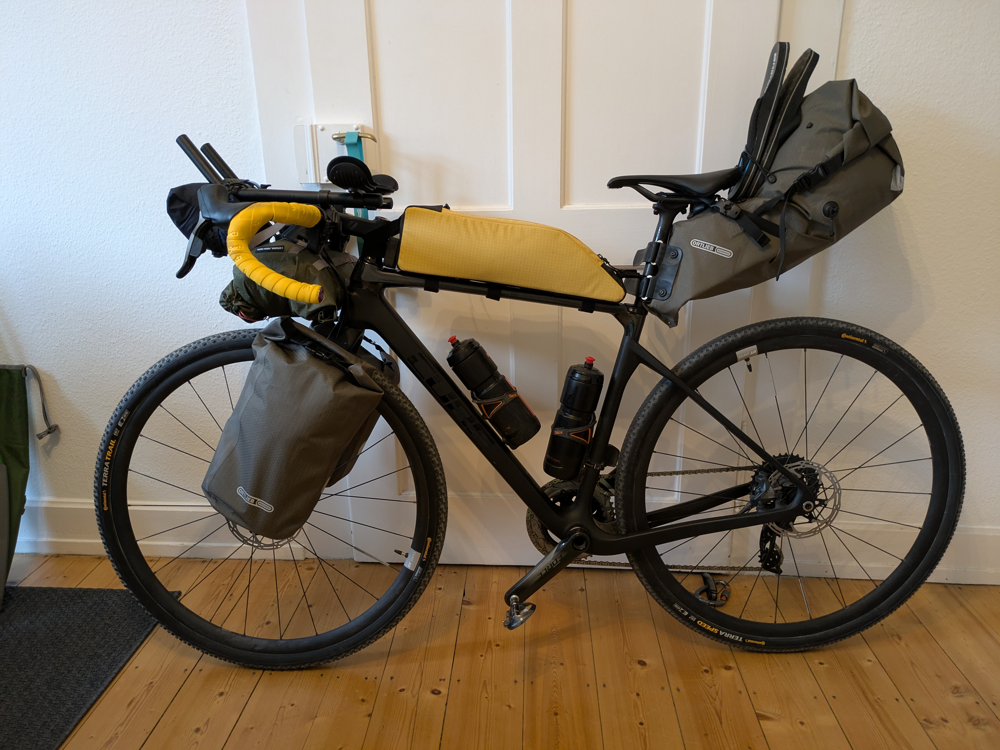

## Route
### Der Plan
Einen Monat lang mit dem Fahrrad durch Dänemark, Schweden und Norwegen zu fahren.
Dabei möchte ich wildcampen und mit möglichst wenig Gepäck reisen.

### Route
Die grobe Planung der Route geht von Flensburg, Kopenhagen, Göteborg, Oslo,
über Larvik mit der Fähre nach Dänemark und an der Westküste Dänemarks zurück
nach Flensburg.
Dabei möchte ich täglich ca. 100 km radeln.


#### Abschnitt 1: Flensburg bis Helsingborg (Schweden)
Über die grossen Inseln Dänemarks und Kopenhagen nach Schweden.


#### Abschnitt 2: Helsingborg bis Göteborg (Schweden)
Westküstenradweg in Südschweden bis Göteborg.


## Gepäck
Das Ziel ist es möglichst leicht zu reisen und dabei eine gute Zeit auf dem Rad
zu haben.

### Camping 2500g
- Zelt
- Groundsheet
- Luftmatratze
- Schlafsack
- Kissen

## Elektronik 1000g
- Navi
- Handy
- Kopflampe
- Rücklicht
- Kopfhörer Shockz 
- Kopfhörer InEar
- Tastatur
- Brustgurt
- Powerbank
- Netzteil
- Ladekabel Micro-USB
- Ladekabel USB-C
- Ladekabel Uhr
- Ladekabel Shockz Kopfhörer
- Ladegerät Schaltung

## Hygiene
- Medipack
- Reiseapotheke
- Sonnencreme
- Creme Gesicht
- Labello
- Nobyte
- Arschcreme
- Zahnbürste
- Zahnpasta
- Zahnseide + Zwischenraumbürste
- Zahnschiene
- Nagelclips
- Rasierer
- Handtuch
- Duschgel + Waschmittel
- Wäscheklammern
- Desinfektionstücher
- Klopapier
- Tempos
- Oropax

## Essen
- Gaskartusche
- Kocher
- Feuerzeug
- Topf
- Falttasse
- Taschenmesser
- Löffel
- Wasserflaschen
- Instant-Kaffee
- Tee
- Datteln

## Klamotten
- Ersatz Radklamotten
	- Hose 
	- Unterhemd 
	- Trikot kurz 
- Buff 2x
- Boulderhose
- Pullover
- TShirt 2x
- Unterhose 2x
- Socken 2x
- Badehose
- Regenjacke
- Überschuhe
- Helm
- Flip-Flops

## Fahrrad
- Schloss
- Reifenheber
- Dichtmilch
- Tubeless-Salami
- Multitool
- Kettenwachs
- Lappen
- Pumpe
- Ersatzteile
	- Schlauch
	- Kabelbinder
	- Kettenschloss
	- Panzerband
	- Schaltauge

## Sonstiges
- Minirucksack
- Buch
- Schwimmbrille
- Terraband

### Fahrrad
Mein Rad ist ein Cube Nuroad C:62SL. Das ist mit Carbon Rahmen und Gabel, sowie elektronische Schaltung nur bedingt für so eine Tour geeignet. Aber ich hoffe einfach, dass das Carbon nichts gegen so viel Gepäck einzuwenden hat.

Zur Bequemlichkeit lasse ich den Triathlon Lenkeraufsatz dran und rüste auf breite Tubeless Stollenreifen um.

