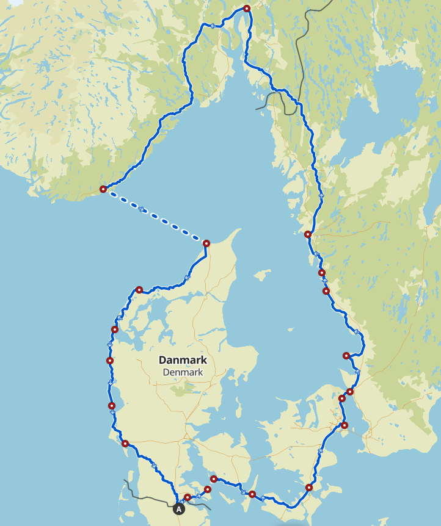

## Route
### Der Plan
Einen Monat lang mit dem Fahrrad durch Dänemark, Schwenden und Norwegen zu fahren.
Dabei möchte ich wildcampen und mit möglichst wenig Gepäck reisen.

### Route
Die Route ist nur grob geplant. Das Feintuning findet unterwegs statt.

[Tour Link komoot](https://www.komoot.com/de-de/tour/2034498871?share_token=aISPLoFO3KX0E0hxm10fPL7w0dY36uWN4zp8HN4CC7btLetpw7&ref=wtd "Grobe Routenplanung")

## Gepäck
Das Ziel ist es mit möglichst leicht reisen. Ob das klappt wird noch ein Packtest zeigen müssen.

## Packliste
#### Lenkertasche:
- Zelt
- Luftmatratze
- Kissen

#### Oberrohrtasche
- ...

#### Arschrakete:
- Schlafsack

#### Gabeltasche links:
- Koch-Set
  - Kocher
  - Gas
  - Feuerzeug
  - Löffel
  - Becher

#### Gabletasche rechts:
- Electronics
  - Powerbank inkl. Ladekabel
  - Ladekabel Handy
  - Ladekabel Schaltung
  - Stirnlampe
  - Bluetooth Tastatur
- Hygiene
  - Zanbuerste
- Medipack

### Fahrrad
Mein Rad ist ein Cube Nuroad C:62SL. Das ist mit Carbon Rahmen und Gabel, sowie elektronische Schaltung nur bedingt für so eine Tour geeignet. Aber ich hoffe einfach, dass das Carbon nichts gegen so viel Gepäck einzuwenden hat.

Zur Bequemlichkeit lasse ich den Triathlon Lenkeraufsatz dran und rüste auf breite Tubeless Stollenreifen um.
